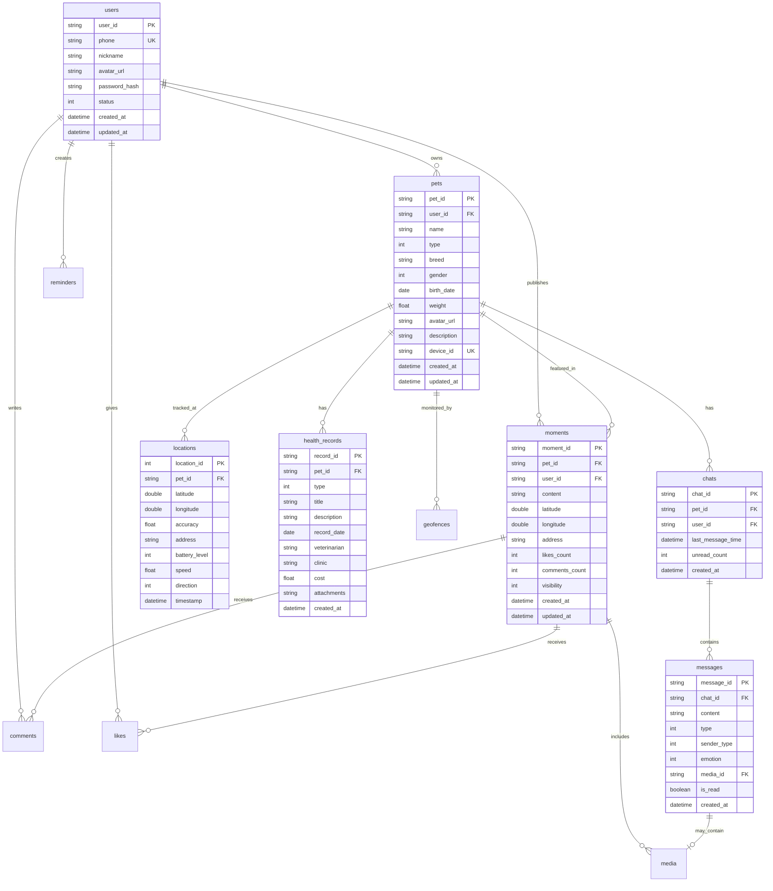

# PetChat Android 数据库设计文档

## 目录

1. [概述](#1-概述)
2. [数据库架构](#2-数据库架构)
3. [实体关系图](#3-实体关系图)
4. [表结构详细设计](#4-表结构详细设计)
5. [索引设计](#5-索引设计)
6. [数据类型转换器](#6-数据类型转换器)
7. [数据迁移策略](#7-数据迁移策略)
8. [性能优化](#8-性能优化)
9. [数据安全](#9-数据安全)

---

## 1. 概述

### 1.1 数据库选型
- **数据库**: SQLite (通过Room持久化库)
- **Room版本**: 2.6.1
- **数据库名称**: petchat_database
- **初始版本**: 1

### 1.2 设计原则
1. **规范化**: 遵循数据库第三范式，避免数据冗余
2. **性能优先**: 合理使用索引，优化查询性能
3. **扩展性**: 预留字段和表结构便于未来扩展
4. **数据完整性**: 使用外键约束保证引用完整性
5. **版本管理**: 支持数据库版本升级和数据迁移

---

## 2. 数据库架构

### 2.1 Room Database配置
```kotlin
@Database(
    entities = [
        UserEntity::class,
        PetEntity::class,
        MessageEntity::class,
        ChatEntity::class,
        LocationEntity::class,
        MomentEntity::class,
        CommentEntity::class,
        LikeEntity::class,
        GeofenceEntity::class,
        HealthRecordEntity::class,
        ReminderEntity::class,
        MediaEntity::class
    ],
    version = 1,
    exportSchema = true
)
@TypeConverters(
    DateConverter::class,
    ListConverter::class,
    EmotionConverter::class,
    LocationConverter::class
)
abstract class PetChatDatabase : RoomDatabase() {
    // DAOs
    abstract fun userDao(): UserDao
    abstract fun petDao(): PetDao
    abstract fun messageDao(): MessageDao
    abstract fun chatDao(): ChatDao
    abstract fun locationDao(): LocationDao
    abstract fun momentDao(): MomentDao
    abstract fun healthRecordDao(): HealthRecordDao
    abstract fun reminderDao(): ReminderDao
}
```

### 2.2 模块划分
| 模块 | 功能 | 主要表 |
|------|------|--------|
| 用户模块 | 用户信息管理 | users |
| 宠物模块 | 宠物信息管理 | pets, health_records |
| 聊天模块 | 对话功能 | chats, messages |
| 定位模块 | 位置追踪 | locations, geofences |
| 社交模块 | 动态分享 | moments, comments, likes |
| 提醒模块 | 事项提醒 | reminders |
| 媒体模块 | 文件管理 | media |

---

## 3. 实体关系图

### 3.1 ER图（Mermaid）


### 3.2 关系说明
1. **一对多关系**:
   - 用户 → 宠物（一个用户可以有多个宠物）
   - 宠物 → 聊天记录（一个宠物有一个聊天会话）
   - 聊天 → 消息（一个聊天包含多条消息）
   - 宠物 → 位置记录（一个宠物有多条位置记录）
   - 用户/宠物 → 动态（可以发布多条动态）

2. **多对多关系**:
   - 用户 ↔ 动态（通过点赞表关联）
   - 动态 ↔ 媒体文件（一个动态可以有多个媒体文件）

---

## 4. 表结构详细设计

### 4.1 用户表（users）
```sql
CREATE TABLE users (
    user_id TEXT PRIMARY KEY,
    phone TEXT UNIQUE NOT NULL,
    nickname TEXT NOT NULL,
    avatar_url TEXT,
    password_hash TEXT NOT NULL,
    status INTEGER DEFAULT 1, -- 1:正常 0:禁用
    last_login_time INTEGER,
    created_at INTEGER NOT NULL,
    updated_at INTEGER NOT NULL
);

CREATE UNIQUE INDEX idx_users_phone ON users(phone);
```

### 4.2 宠物表（pets）
```sql
CREATE TABLE pets (
    pet_id TEXT PRIMARY KEY,
    user_id TEXT NOT NULL,
    name TEXT NOT NULL,
    type INTEGER NOT NULL, -- 0:狗 1:猫 2:鸟 3:兔子 4:其他
    breed TEXT,
    gender INTEGER NOT NULL, -- 0:雄性 1:雌性
    birth_date INTEGER NOT NULL,
    weight REAL,
    avatar_url TEXT,
    description TEXT,
    device_id TEXT UNIQUE, -- 定位设备ID
    is_online INTEGER DEFAULT 0,
    created_at INTEGER NOT NULL,
    updated_at INTEGER NOT NULL,
    FOREIGN KEY (user_id) REFERENCES users(user_id) ON DELETE CASCADE
);

CREATE INDEX idx_pets_user_id ON pets(user_id);
CREATE UNIQUE INDEX idx_pets_device_id ON pets(device_id);
```

### 4.3 聊天表（chats）
```sql
CREATE TABLE chats (
    chat_id TEXT PRIMARY KEY,
    pet_id TEXT NOT NULL,
    user_id TEXT NOT NULL,
    last_message_time INTEGER,
    last_message_content TEXT,
    unread_count INTEGER DEFAULT 0,
    created_at INTEGER NOT NULL,
    FOREIGN KEY (pet_id) REFERENCES pets(pet_id) ON DELETE CASCADE,
    FOREIGN KEY (user_id) REFERENCES users(user_id) ON DELETE CASCADE,
    UNIQUE (pet_id, user_id)
);

CREATE INDEX idx_chats_pet_user ON chats(pet_id, user_id);
CREATE INDEX idx_chats_last_message_time ON chats(last_message_time);
```

### 4.4 消息表（messages）
```sql
CREATE TABLE messages (
    message_id TEXT PRIMARY KEY,
    chat_id TEXT NOT NULL,
    content TEXT NOT NULL,
    type INTEGER NOT NULL, -- 0:文本 1:图片 2:语音 3:视频
    sender_type INTEGER NOT NULL, -- 0:用户 1:宠物
    emotion INTEGER DEFAULT 0, -- 宠物情绪
    media_id TEXT,
    voice_duration INTEGER, -- 语音时长(秒)
    is_read INTEGER DEFAULT 0,
    is_deleted INTEGER DEFAULT 0,
    created_at INTEGER NOT NULL,
    FOREIGN KEY (chat_id) REFERENCES chats(chat_id) ON DELETE CASCADE,
    FOREIGN KEY (media_id) REFERENCES media(media_id) ON DELETE SET NULL
);

CREATE INDEX idx_messages_chat_id ON messages(chat_id);
CREATE INDEX idx_messages_created_at ON messages(created_at);
CREATE INDEX idx_messages_chat_time ON messages(chat_id, created_at);
```

### 4.5 位置记录表（locations）
```sql
CREATE TABLE locations (
    location_id INTEGER PRIMARY KEY AUTOINCREMENT,
    pet_id TEXT NOT NULL,
    latitude REAL NOT NULL,
    longitude REAL NOT NULL,
    accuracy REAL,
    altitude REAL,
    address TEXT,
    battery_level INTEGER, -- 电量百分比
    speed REAL, -- 速度 m/s
    direction INTEGER, -- 方向 0-359度
    is_indoor INTEGER DEFAULT 0,
    timestamp INTEGER NOT NULL,
    created_at INTEGER NOT NULL,
    FOREIGN KEY (pet_id) REFERENCES pets(pet_id) ON DELETE CASCADE
);

CREATE INDEX idx_locations_pet_id ON locations(pet_id);
CREATE INDEX idx_locations_timestamp ON locations(timestamp);
CREATE INDEX idx_locations_pet_time ON locations(pet_id, timestamp);
```

### 4.6 动态表（moments）
```sql
CREATE TABLE moments (
    moment_id TEXT PRIMARY KEY,
    pet_id TEXT NOT NULL,
    user_id TEXT NOT NULL,
    content TEXT NOT NULL,
    latitude REAL,
    longitude REAL,
    address TEXT,
    likes_count INTEGER DEFAULT 0,
    comments_count INTEGER DEFAULT 0,
    shares_count INTEGER DEFAULT 0,
    visibility INTEGER DEFAULT 0, -- 0:公开 1:好友可见 2:私密
    is_deleted INTEGER DEFAULT 0,
    created_at INTEGER NOT NULL,
    updated_at INTEGER NOT NULL,
    FOREIGN KEY (pet_id) REFERENCES pets(pet_id) ON DELETE CASCADE,
    FOREIGN KEY (user_id) REFERENCES users(user_id) ON DELETE CASCADE
);

CREATE INDEX idx_moments_pet_id ON moments(pet_id);
CREATE INDEX idx_moments_user_id ON moments(user_id);
CREATE INDEX idx_moments_created_at ON moments(created_at);
CREATE INDEX idx_moments_visibility ON moments(visibility);
```

### 4.7 评论表（comments）
```sql
CREATE TABLE comments (
    comment_id TEXT PRIMARY KEY,
    moment_id TEXT NOT NULL,
    user_id TEXT NOT NULL,
    content TEXT NOT NULL,
    reply_to_id TEXT, -- 回复的评论ID
    reply_to_user_id TEXT, -- 回复的用户ID
    is_deleted INTEGER DEFAULT 0,
    created_at INTEGER NOT NULL,
    FOREIGN KEY (moment_id) REFERENCES moments(moment_id) ON DELETE CASCADE,
    FOREIGN KEY (user_id) REFERENCES users(user_id) ON DELETE CASCADE,
    FOREIGN KEY (reply_to_id) REFERENCES comments(comment_id) ON DELETE SET NULL
);

CREATE INDEX idx_comments_moment_id ON comments(moment_id);
CREATE INDEX idx_comments_user_id ON comments(user_id);
CREATE INDEX idx_comments_created_at ON comments(created_at);
```

### 4.8 点赞表（likes）
```sql
CREATE TABLE likes (
    like_id INTEGER PRIMARY KEY AUTOINCREMENT,
    moment_id TEXT NOT NULL,
    user_id TEXT NOT NULL,
    created_at INTEGER NOT NULL,
    FOREIGN KEY (moment_id) REFERENCES moments(moment_id) ON DELETE CASCADE,
    FOREIGN KEY (user_id) REFERENCES users(user_id) ON DELETE CASCADE,
    UNIQUE (moment_id, user_id)
);

CREATE INDEX idx_likes_moment_id ON likes(moment_id);
CREATE INDEX idx_likes_user_id ON likes(user_id);
```

### 4.9 电子围栏表（geofences）
```sql
CREATE TABLE geofences (
    geofence_id TEXT PRIMARY KEY,
    pet_id TEXT NOT NULL,
    name TEXT NOT NULL,
    center_latitude REAL NOT NULL,
    center_longitude REAL NOT NULL,
    radius REAL NOT NULL, -- 半径(米)
    is_enabled INTEGER DEFAULT 1,
    notification_enabled INTEGER DEFAULT 1,
    created_at INTEGER NOT NULL,
    updated_at INTEGER NOT NULL,
    FOREIGN KEY (pet_id) REFERENCES pets(pet_id) ON DELETE CASCADE
);

CREATE INDEX idx_geofences_pet_id ON geofences(pet_id);
CREATE INDEX idx_geofences_enabled ON geofences(is_enabled);
```

### 4.10 健康记录表（health_records）
```sql
CREATE TABLE health_records (
    record_id TEXT PRIMARY KEY,
    pet_id TEXT NOT NULL,
    type INTEGER NOT NULL, -- 0:疫苗 1:体检 2:驱虫 3:疾病 4:手术 5:其他
    title TEXT NOT NULL,
    description TEXT,
    record_date INTEGER NOT NULL,
    next_date INTEGER, -- 下次时间(如疫苗)
    veterinarian TEXT, -- 兽医
    clinic TEXT, -- 诊所
    cost REAL, -- 费用
    attachments TEXT, -- JSON数组，存储图片URL
    created_at INTEGER NOT NULL,
    updated_at INTEGER NOT NULL,
    FOREIGN KEY (pet_id) REFERENCES pets(pet_id) ON DELETE CASCADE
);

CREATE INDEX idx_health_records_pet_id ON health_records(pet_id);
CREATE INDEX idx_health_records_type ON health_records(type);
CREATE INDEX idx_health_records_date ON health_records(record_date);
```

### 4.11 提醒表（reminders）
```sql
CREATE TABLE reminders (
    reminder_id TEXT PRIMARY KEY,
    user_id TEXT NOT NULL,
    pet_id TEXT,
    type INTEGER NOT NULL, -- 0:喂食 1:遛狗 2:洗澡 3:疫苗 4:体检 5:用药 6:自定义
    title TEXT NOT NULL,
    description TEXT,
    reminder_time INTEGER NOT NULL,
    repeat_type INTEGER DEFAULT 0, -- 0:不重复 1:每天 2:每周 3:每月 4:每年
    repeat_interval INTEGER DEFAULT 0, -- 重复间隔
    is_enabled INTEGER DEFAULT 1,
    is_completed INTEGER DEFAULT 0,
    created_at INTEGER NOT NULL,
    updated_at INTEGER NOT NULL,
    FOREIGN KEY (user_id) REFERENCES users(user_id) ON DELETE CASCADE,
    FOREIGN KEY (pet_id) REFERENCES pets(pet_id) ON DELETE CASCADE
);

CREATE INDEX idx_reminders_user_id ON reminders(user_id);
CREATE INDEX idx_reminders_pet_id ON reminders(pet_id);
CREATE INDEX idx_reminders_time ON reminders(reminder_time);
CREATE INDEX idx_reminders_enabled ON reminders(is_enabled);
```

### 4.12 媒体文件表（media）
```sql
CREATE TABLE media (
    media_id TEXT PRIMARY KEY,
    type INTEGER NOT NULL, -- 0:图片 1:视频 2:音频
    url TEXT NOT NULL,
    thumbnail_url TEXT, -- 缩略图
    size INTEGER, -- 文件大小(字节)
    width INTEGER, -- 图片/视频宽度
    height INTEGER, -- 图片/视频高度
    duration INTEGER, -- 音频/视频时长(秒)
    mime_type TEXT,
    upload_status INTEGER DEFAULT 0, -- 0:上传中 1:成功 2:失败
    created_at INTEGER NOT NULL
);

CREATE INDEX idx_media_type ON media(type);
CREATE INDEX idx_media_created_at ON media(created_at);
```

### 4.13 动态媒体关联表（moment_media）
```sql
CREATE TABLE moment_media (
    id INTEGER PRIMARY KEY AUTOINCREMENT,
    moment_id TEXT NOT NULL,
    media_id TEXT NOT NULL,
    sort_order INTEGER DEFAULT 0,
    FOREIGN KEY (moment_id) REFERENCES moments(moment_id) ON DELETE CASCADE,
    FOREIGN KEY (media_id) REFERENCES media(media_id) ON DELETE CASCADE,
    UNIQUE (moment_id, media_id)
);

CREATE INDEX idx_moment_media_moment ON moment_media(moment_id);
CREATE INDEX idx_moment_media_media ON moment_media(media_id);
```

---

## 5. 索引设计

### 5.1 索引策略
1. **主键索引**: 所有主键自动创建索引
2. **外键索引**: 所有外键字段创建索引
3. **查询索引**: 频繁查询的字段创建索引
4. **联合索引**: 多字段查询创建联合索引

### 5.2 索引列表
| 表名 | 索引名 | 字段 | 类型 | 用途 |
|------|--------|------|------|------|
| users | idx_users_phone | phone | UNIQUE | 手机号查询 |
| pets | idx_pets_user_id | user_id | NORMAL | 用户的宠物列表 |
| messages | idx_messages_chat_time | chat_id, created_at | COMPOSITE | 聊天记录分页 |
| locations | idx_locations_pet_time | pet_id, timestamp | COMPOSITE | 历史轨迹查询 |
| moments | idx_moments_created_at | created_at | NORMAL | 动态时间线 |

---

## 6. 数据类型转换器

### 6.1 日期转换器
```kotlin
class DateConverter {
    @TypeConverter
    fun fromTimestamp(value: Long?): Date? {
        return value?.let { Date(it) }
    }

    @TypeConverter
    fun dateToTimestamp(date: Date?): Long? {
        return date?.time
    }
}
```

### 6.2 列表转换器
```kotlin
class ListConverter {
    private val gson = Gson()
    
    @TypeConverter
    fun fromStringList(value: String?): List<String>? {
        return value?.let {
            gson.fromJson(it, object : TypeToken<List<String>>() {}.type)
        }
    }

    @TypeConverter
    fun fromListString(list: List<String>?): String? {
        return list?.let { gson.toJson(it) }
    }
}
```

### 6.3 枚举转换器
```kotlin
class EmotionConverter {
    @TypeConverter
    fun fromEmotion(emotion: PetEmotion): Int {
        return emotion.ordinal
    }

    @TypeConverter
    fun toEmotion(ordinal: Int): PetEmotion {
        return PetEmotion.values()[ordinal]
    }
}
```

---

## 7. 数据迁移策略

### 7.1 版本升级规则
1. **增加字段**: 使用ALTER TABLE ADD COLUMN
2. **删除字段**: 创建新表，复制数据，删除旧表
3. **修改字段**: 同删除字段处理方式
4. **增加表**: 直接CREATE TABLE
5. **删除表**: DROP TABLE

### 7.2 迁移示例
```kotlin
// 版本1到版本2：添加消息已读字段
val MIGRATION_1_2 = object : Migration(1, 2) {
    override fun migrate(database: SupportSQLiteDatabase) {
        database.execSQL(
            "ALTER TABLE messages ADD COLUMN is_read INTEGER DEFAULT 0"
        )
    }
}

// 版本2到版本3：添加健康记录表
val MIGRATION_2_3 = object : Migration(2, 3) {
    override fun migrate(database: SupportSQLiteDatabase) {
        database.execSQL("""
            CREATE TABLE IF NOT EXISTS health_records (
                record_id TEXT PRIMARY KEY NOT NULL,
                pet_id TEXT NOT NULL,
                type INTEGER NOT NULL,
                title TEXT NOT NULL,
                description TEXT,
                record_date INTEGER NOT NULL,
                next_date INTEGER,
                veterinarian TEXT,
                clinic TEXT,
                cost REAL,
                attachments TEXT,
                created_at INTEGER NOT NULL,
                updated_at INTEGER NOT NULL,
                FOREIGN KEY (pet_id) REFERENCES pets(pet_id) ON DELETE CASCADE
            )
        """)
        
        database.execSQL(
            "CREATE INDEX idx_health_records_pet_id ON health_records(pet_id)"
        )
    }
}
```

### 7.3 数据库构建器配置
```kotlin
Room.databaseBuilder(context, PetChatDatabase::class.java, "petchat_database")
    .addMigrations(MIGRATION_1_2, MIGRATION_2_3)
    .addCallback(object : RoomDatabase.Callback() {
        override fun onCreate(db: SupportSQLiteDatabase) {
            super.onCreate(db)
            // 初始化数据
            insertDefaultData(db)
        }
    })
    .build()
```

---

## 8. 性能优化

### 8.1 查询优化
1. **使用索引**: 确保WHERE、ORDER BY、JOIN条件使用索引
2. **限制结果集**: 使用LIMIT分页查询
3. **避免全表扫描**: 使用合适的WHERE条件
4. **批量操作**: 使用事务批量插入/更新

### 8.2 Room查询优化示例
```kotlin
@Dao
interface MessageDao {
    // 使用分页库
    @Query("""
        SELECT * FROM messages 
        WHERE chat_id = :chatId 
        ORDER BY created_at DESC
    """)
    fun getMessagesPaged(chatId: String): PagingSource<Int, MessageEntity>
    
    // 批量插入
    @Insert(onConflict = OnConflictStrategy.REPLACE)
    suspend fun insertMessages(messages: List<MessageEntity>)
    
    // 使用索引字段查询
    @Query("""
        SELECT * FROM messages 
        WHERE chat_id = :chatId AND created_at > :timestamp
        ORDER BY created_at DESC
        LIMIT :limit
    """)
    suspend fun getRecentMessages(
        chatId: String, 
        timestamp: Long, 
        limit: Int
    ): List<MessageEntity>
}
```

### 8.3 数据库优化配置
```kotlin
@Database(
    entities = [...],
    version = 1,
    exportSchema = true
)
abstract class PetChatDatabase : RoomDatabase() {
    companion object {
        fun create(context: Context): PetChatDatabase {
            return Room.databaseBuilder(...)
                .setJournalMode(JournalMode.TRUNCATE) // 优化写入性能
                .setQueryExecutor(Executors.newFixedThreadPool(4)) // 查询线程池
                .build()
        }
    }
}
```

---

## 9. 数据安全

### 9.1 敏感数据加密
```kotlin
// 使用SQLCipher加密数据库
implementation "net.zetetic:android-database-sqlcipher:4.5.0"

// 创建加密数据库
val passphrase = SQLiteDatabase.getBytes("your-secret-passphrase".toCharArray())
val factory = SupportFactory(passphrase)

Room.databaseBuilder(context, PetChatDatabase::class.java, "petchat_database")
    .openHelperFactory(factory)
    .build()
```

### 9.2 数据备份
```kotlin
// 自动备份规则
// res/xml/backup_rules.xml
<?xml version="1.0" encoding="utf-8"?>
<full-backup-content>
    <include domain="database" path="petchat_database"/>
    <exclude domain="database" path="petchat_database-wal"/>
    <exclude domain="database" path="petchat_database-shm"/>
</full-backup-content>
```

### 9.3 数据清理策略
```kotlin
// 定期清理过期数据
@Dao
interface CleanupDao {
    // 清理30天前的位置数据
    @Query("""
        DELETE FROM locations 
        WHERE timestamp < :timestamp
    """)
    suspend fun cleanOldLocations(timestamp: Long)
    
    // 清理已删除的消息
    @Query("""
        DELETE FROM messages 
        WHERE is_deleted = 1 AND created_at < :timestamp
    """)
    suspend fun cleanDeletedMessages(timestamp: Long)
}
```

---

## 附录

### A. 数据库工具类
```kotlin
object DatabaseUtils {
    // 导出数据库
    fun exportDatabase(context: Context, database: PetChatDatabase): File {
        val exportDir = File(context.getExternalFilesDir(null), "backup")
        if (!exportDir.exists()) {
            exportDir.mkdirs()
        }
        
        val file = File(exportDir, "petchat_backup_${System.currentTimeMillis()}.db")
        database.close()
        
        val dbFile = context.getDatabasePath("petchat_database")
        dbFile.copyTo(file, overwrite = true)
        
        return file
    }
    
    // 导入数据库
    fun importDatabase(context: Context, backupFile: File): Boolean {
        return try {
            val dbFile = context.getDatabasePath("petchat_database")
            backupFile.copyTo(dbFile, overwrite = true)
            true
        } catch (e: Exception) {
            false
        }
    }
}
```

### B. 常用查询SQL
```sql
-- 获取用户的所有宠物及最新位置
SELECT p.*, l.latitude, l.longitude, l.address, l.timestamp
FROM pets p
LEFT JOIN (
    SELECT pet_id, latitude, longitude, address, timestamp,
           ROW_NUMBER() OVER (PARTITION BY pet_id ORDER BY timestamp DESC) as rn
    FROM locations
) l ON p.pet_id = l.pet_id AND l.rn = 1
WHERE p.user_id = ?;

-- 获取聊天列表及最新消息
SELECT c.*, m.content as last_message, m.created_at as last_message_time
FROM chats c
LEFT JOIN (
    SELECT chat_id, content, created_at,
           ROW_NUMBER() OVER (PARTITION BY chat_id ORDER BY created_at DESC) as rn
    FROM messages
    WHERE is_deleted = 0
) m ON c.chat_id = m.chat_id AND m.rn = 1
WHERE c.user_id = ?
ORDER BY m.created_at DESC;

-- 统计宠物活动数据
SELECT 
    DATE(timestamp/1000, 'unixepoch') as date,
    COUNT(*) as location_count,
    MAX(speed) as max_speed,
    SUM(CASE WHEN speed > 0 THEN 1 ELSE 0 END) * 1.0 / COUNT(*) as activity_rate
FROM locations
WHERE pet_id = ? AND timestamp > ?
GROUP BY date
ORDER BY date DESC;
```

---

*文档版本：1.0.0*  
*最后更新：2025-01-27*